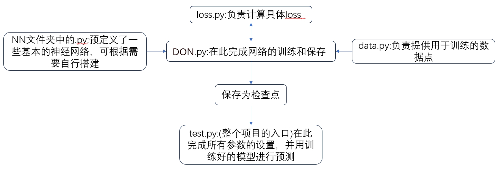
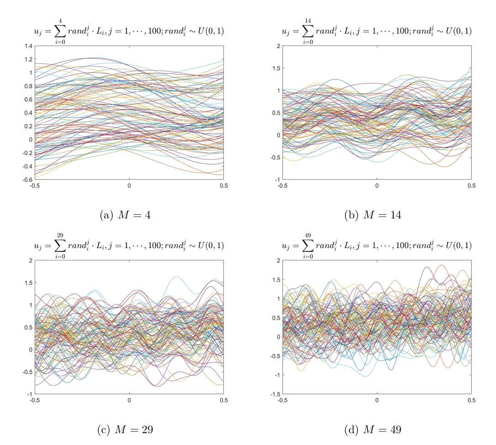
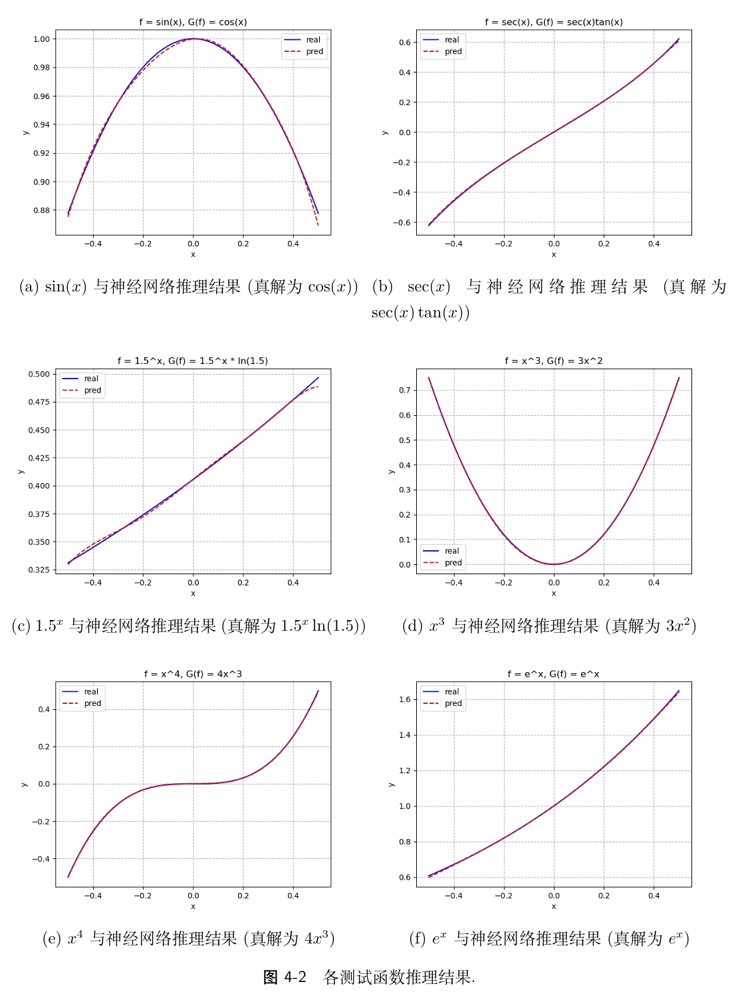

# 一个简易的模块化深度算子神经网络实现(DeepONet)

## 简介

本项目利用pytorch实现了一个简易的模块化DeepONet，凭此可以快速的实现一些简易的DeepONet。

## 引用

## 更新

## 代码结构

对于上述的代码，简述以下几个关键部分：

1. `NN` 中的各个`.py`，定义了一些基本的神经网络的类模型，具体搭建方法参考文件内部注释。
2. `data.py` 是数据的生成文件，创建了数据类`data`，其主要功能是加载所需的数据集
3. `loss.py` 是定义了损失函数类的文件，这里定制了特定的损失函数，并把损失函数封装成了`LossCompute`类。
4. `DON.py` 是使用上述定义的网络结构、数据和损失函数进行训练的主程序，其中的`DON`类中实现了模型的训练、模型参数的保存等功能。
6. `test.py`是项目的入口，这里完成所有参数的初始化及后续的数据处理，提供了设置随机种子、设置随机化方法以及读取模型参数的功能。

具体来看，使用这4个文件实现的流程如下：

1. 首先，需要在`test.py`文件中确定训练的一些参数，例如随机种子、训练的周期总数、$loss$阈值、损失函数、模型、数据点、优化器、权重初始化方式、损失权重和计算设备。然后以上述参数创建一个`DON`对象。

2. 调用`DON`对象中的`train_all()`方法，开始训练。在训练中，根据设定的总周期数进行循环，在每一次循环中，计算损失函数，并进行反向传播和参数更新。

3. 在`train_all()`方法中，可以对模型进行保存，并且模型的参数、优化器的状态、当前训练的周期数以及当前的损失值都会被保存下来。这样的话，当想要接着之前的状态继续训练模型、或者使用训练好的模型进行预测时，就可以直接加载之前保存的模型。 

4. 直接加载刚刚训练所保存的参数(或者加载之前训练所保存的参数)，并进行后续预测及绘图。

上述就是这四份代码文件的基本用法和使用流程，具体的参数设置需要根据实际的需求和数据情况进行设置。

## 运行方法

直接运行`test.py`即可，程序将会用DeepONet学习在$[-\frac{1}{2}, \frac{1}{2}]$​上的求导算子：
$$
\begin{aligned}
G:f(x) &\mapsto \frac{d}{dx}f(x). \\
\end{aligned}
$$
这里可以以正交多项式基或者高斯随机场抽取数据集，见`DON.m`。

数据集的格式为$\{\boldsymbol{f}_n(x), \boldsymbol{y}_j, u_{f_{n}}(\boldsymbol{y}_j)\},$其中$\boldsymbol{f}_n(x)=(f_{n}(x_1), \cdots, f_{n}(x_m)),$代表$f_n$在采样点$x_1, \cdots, x_m$处的值$\boldsymbol{f}_n(x)=(f_{n}(x_1), \cdots, f_{n}(x_m)),$而$u_{f_n}(\boldsymbol{y}_j)=f'_n(\boldsymbol{y}_j)$代表$f'_n$在评估点$\boldsymbol{y}_j=y_j, j=1, \cdots, y_K$处的值.

例如, 取$f_1=x^2,$  $f_2=\sin(x),$ $x_1=0,$ $x_2=\pi,$ $\boldsymbol{y}_1=\frac{\pi}{2},$ $\boldsymbol{y}_2=1,$ 则针对求导算子的数据集$\{\boldsymbol{f}_n(x), \boldsymbol{y}_j, u_{f_{n}}(\boldsymbol{y}_j)\}, n=1, \cdots, 2, j=1, \cdots, 2$​为
$$
dataset :=
    \left(
    \begin{array}{cccc}
        x^2|_{x=0} & x^2|_{x=\pi} & \frac{\pi}{2} & 2x^2|_{x=\frac{\pi}{2}} \\
        x^2|_{x=0} & x^2|_{x=\pi} & 1 & 2x^2|_{x=1} \\
        \sin(x)|_{x=0} & \sin(x)|_{x=\pi} & \frac{\pi}{2} & \cos(x)|_{x=\frac{\pi}{2}} \\
        \sin(x)|_{x=0} & \sin(x)|_{x=\pi} & 1 & \cos(x)|_{x=1} \\ 
    \end{array}
    \right)
    =
    \left(
    \begin{array}{cccc}
        0 & \pi^2 & \frac{\pi}{2} & \frac{\pi^2}{2} \\
        0 & \pi^2 & 1 & 2 \\
        0 & 0 & \frac{\pi}{2} & 0 \\
        0 & 0 & 1 & \cos(1) \\ 
    \end{array}
    \right)
    .
$$

## 编译条件

python 3.12.2

pytorch 2.2 +cu12.1

## 运行结果

不同的参数所选取的训练函数:

训练结果(注意，测试函数并未在训练集中出现):

## 注意事项

1.即便设置了相同的随机种子，哪怕使用同一机器的不同设备(如GPU:0和GPU:1、GPU和CPU)，最终结果仍可能**不同!**

2.针对不同的方程和条件,`point`,`LossCompute`类可能需要重写

## 深度算子神经网络简介(DeepONet)

DeepONet通过最小化如下损失函数来训练神经网络:
$$
\mathcal{L}=\frac{1}{NK}\sum_{n=1}^{N}\sum_{j=1}^{K}\left|u_{f_n}(\boldsymbol{y}_j)-\hat{u}_{f_n}(\boldsymbol{y}_j)\right|^2.
$$
训练好神经网络后, 对于任意异于训练集中的输入函数$f_{new}$, DeepONet可以直接进行推理预测而无需进行任何形式的重新训练, 但是PINN则需要对新的输入函数进行重新训练.
